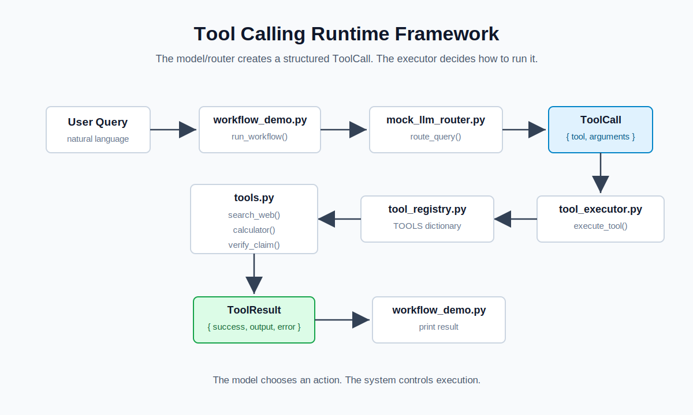
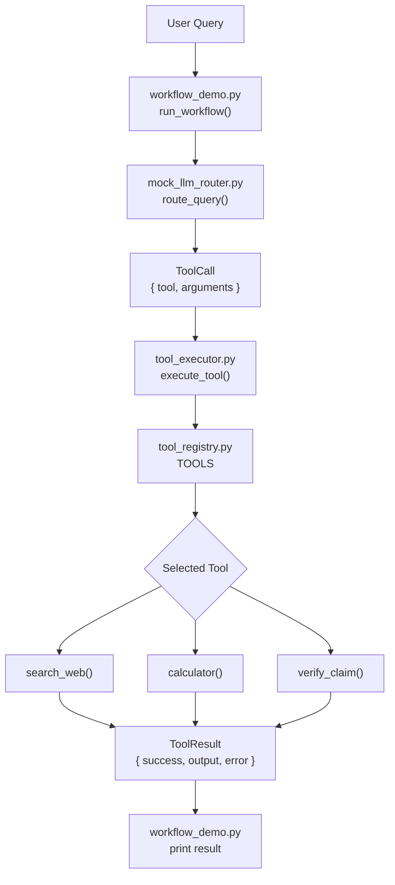

# Tool Calling Mini Project

This mini project demonstrates how tool calling works in modern AI systems.

The example simulates a small workflow:

```text
User Query
    ↓
LLM Router
    ↓
Tool Registry
    ↓
Tool Execution
    ↓
Structured Result
    ↓
Workflow Decision
```

The goal is not to build a production agent system.

The goal is to understand why tool calling became such an important part of modern AI workflows.

---

# Why Tool Calling Matters

At first, many AI demos looked like advanced chat interfaces.

But modern AI systems often do much more than generate text.

They:

- search the web
- query databases
- call APIs
- execute tools
- trigger workflows
- generate reports

Because of this, LLMs are starting to behave less like text generators and more like workflow coordinators.

---

# LLMs vs Tools

One important idea is:

> LLMs are probabilistic. Tools are deterministic.

For example, an LLM may:

- hallucinate
- calculate incorrectly
- use outdated information
- generate inconsistent outputs

But tools usually behave predictably.

A calculator always follows mathematical rules.

A database query always returns structured records.

A search tool always returns defined fields.

This is one reason tool calling became important in AI systems.

---

# Why Plain Text Is Not Enough

A user may ask:

```text
Search for recent AI systems articles.
```

But the system usually needs something more structured.

For example:

```json
{
  "tool": "search_web",
  "arguments": {
    "query": "recent AI systems articles"
  }
}
```

Now the output becomes executable.

The system knows:

- which tool to call
- which arguments to use
- what workflow step should happen next

---

# Tool Calling as Workflow Control

Tool calling is not only about calling functions.

It also changes the role of the LLM.

Instead of only generating text, the model now helps control workflow behavior.

Example:

```text
User Query
    ↓
Planner decides next action
    ↓
Tool execution
    ↓
Structured tool result
    ↓
Verifier checks output
    ↓
Final response
```

The model becomes part of a larger orchestration system.

---

# Why Structured Outputs Matter Here

Tool calling usually depends on structured outputs.

For example:

```json
{
  "tool": "search_web",
  "arguments": {
    "query": "AI systems"
  }
}
```

The system cannot safely execute arbitrary free-form text.

It needs:

- stable field names
- predictable arguments
- validation rules

This is why tool calling and structured outputs are closely connected.

---

# Project Structure

```text
04_tool_calling/
│
├── notes.md
├── article.md
├── tools.py
├── tool_registry.py
├── mock_llm_router.py
├── tool_executor.py
├── workflow_demo.py
└── schemas.py
```

---

# Recommended Reading Order

```text
notes.md
    ↓
schemas.py
    ↓
tools.py
    ↓
tool_registry.py
    ↓
mock_llm_router.py
    ↓
tool_executor.py
    ↓
workflow_demo.py
```

---

# How to Run

Run the full workflow from the project root:

```bash
uv run python 04_tool_calling/workflow_demo.py
```

The runtime entry point is `workflow_demo.py`.

The execution order is:

```text
workflow_demo.py
    ↓
mock_llm_router.py
    ↓
tool_executor.py
    ↓
tool_registry.py
    ↓
tools.py
```

`schemas.py` is used by the router and executor to keep tool calls and tool results structured.

---

# Runtime Framework Diagram





The important idea is that the model/router does not execute the tool directly.

It creates a structured `ToolCall`, and the executor decides whether and how to run it.

---

# What Each File Represents

| File | Role |
|---|---|
| `schemas.py` | Defines structured tool schemas |
| `tools.py` | Defines available tools |
| `tool_registry.py` | Stores available tool mappings |
| `mock_llm_router.py` | Simulates LLM tool selection |
| `tool_executor.py` | Executes selected tools |
| `workflow_demo.py` | Runs the full workflow |

---

# Mental Model

This project simulates a simplified agent workflow:

```text
LLM decides action
    ↓
Tool executes action
    ↓
Workflow continues
```

The important idea is:

> tool calling turns model outputs into executable workflow actions.

---

# Important Takeaway

Tool calling is becoming one of the core building blocks of modern AI systems.

It helps connect:

- reasoning
- execution
- retrieval
- validation
- orchestration

into larger workflows.
